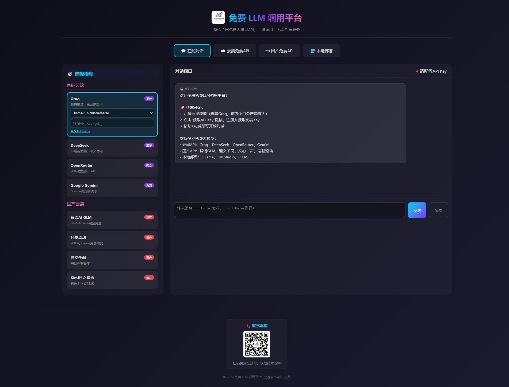
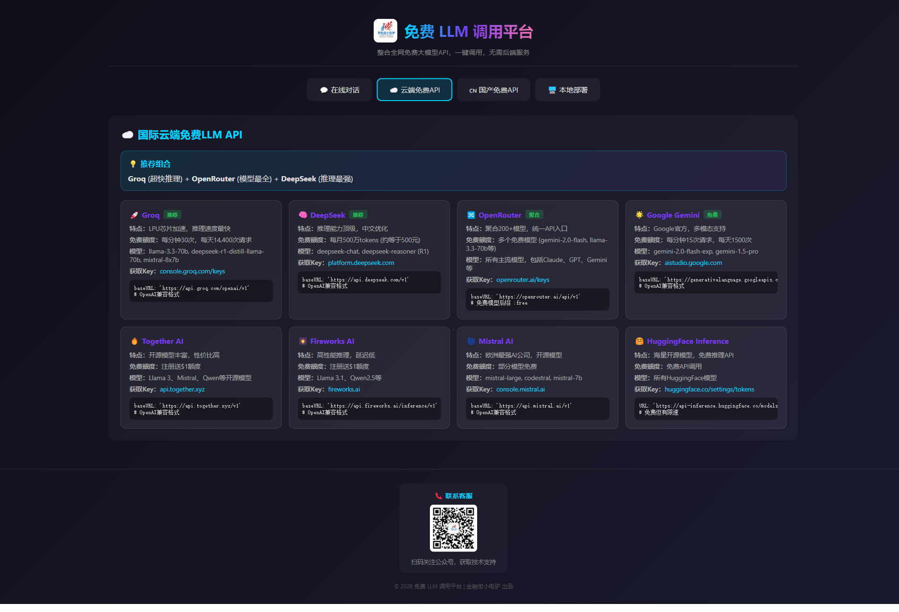
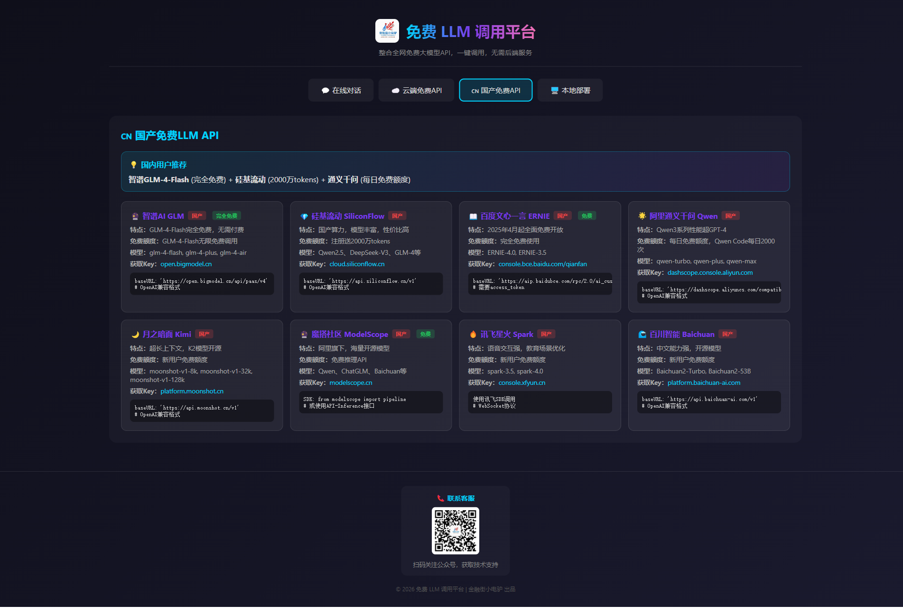
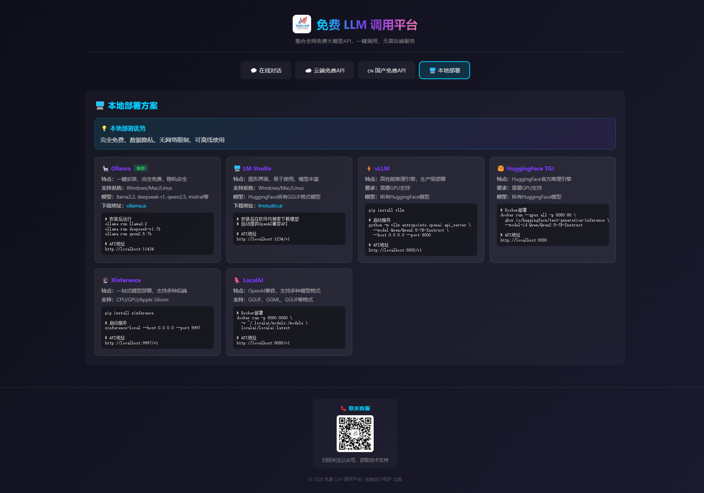

# 零成本玩转大模型：普通人的AI进阶指南

> 不花一分钱，也能成为大模型专业用户

---

## 写在前面

ChatGPT火了两年，你是否还在观望？

想用GPT-4，每月20美元太贵；想用国产大模型，又不知道哪个好用；想本地部署，显卡配置跟不上...

今天，我要分享一个**零成本**玩转大模型的方案，让你从普通用户进阶为AI专业玩家。

---

## 一、为什么你需要这个工具？

### 痛点一：大模型太多，不知道选哪个

市面上的大模型有上百个：OpenAI、Claude、Gemini、通义千问、文心一言、智谱GLM、DeepSeek...

每个都要注册账号、都要付费、都要学习不同的使用方式，太麻烦了！

### 痛点二：免费额度太少，不够用

很多平台号称免费，实际上：
- 每天只能问几个问题
- 模型被阉割，能力打折
- 免费期过了就要付费

### 痛点三：想本地部署，门槛太高

本地运行大模型需要：
- 高端显卡（RTX 3060起步）
- 技术能力（命令行、环境配置）
- 大量时间（模型下载、调试）

---

## 二、解决方案：免费LLM调用平台

我开发了一个**统一入口**，整合了全网免费大模型资源：



### 核心功能

**1. 一站式接入，无需切换**

左侧选择模型，右侧直接对话。支持：
- ☁️ 国际云端：Groq、DeepSeek、OpenRouter、Gemini
- 🇨🇳 国产云端：智谱GLM、通义千问、文心一言、硅基流动
- 🖥️ 本地部署：Ollama、LM Studio、vLLM

**2. 免费额度，足够日常使用**

| 平台 | 免费额度 | 特点 |
|------|----------|------|
| Groq | 每天14,400次请求 | LPU芯片，超快推理 |
| DeepSeek | 每月500万tokens | 推理能力强，中文优化 |
| 智谱GLM | GLM-4-Flash完全免费 | 国产之光，无需付费 |
| 硅基流动 | 注册送2000万tokens | 国产算力，模型丰富 |

**3. 零门槛使用**

- 无需安装，浏览器打开即用
- 无需配置环境，输入API Key即可
- 无需学习API，图形界面操作

---

## 三、手把手教你使用

### 第一步：选择模型



推荐从 **Groq** 开始：
1. 速度快（LPU芯片，毫秒级响应）
2. 免费额度大（每天近1.5万次请求）
3. 支持主流开源模型（Llama 3、Mixtral）

### 第二步：获取API Key

点击"获取API Key"链接，注册账号：

1. 访问 https://console.groq.com/keys
2. 用Google账号一键登录
3. 点击"Create API Key"
4. 复制生成的Key（格式：gsk_xxxxxx）

> 💡 小贴士：Groq支持Google一键登录，无需填写个人信息，30秒搞定！

### 第三步：开始对话



将API Key粘贴到输入框，就可以开始对话了！

---

## 四、进阶玩法

### 1. 国产大模型对比

如果你更关注中文能力，可以选择国产模型：

| 模型 | 免费情况 | 适用场景 |
|------|----------|----------|
| 智谱GLM-4-Flash | 完全免费 | 日常对话、写作 |
| 通义千问 | 每日免费额度 | 长文本处理 |
| 文心一言 | 2025年4月起免费 | 百度生态集成 |
| DeepSeek | 每月500万tokens | 推理、编程 |

### 2. 本地部署方案



如果你有显卡资源，可以本地部署：

**Ollama（推荐新手）**
```bash
# 安装（一行命令）
curl -fsSL https://ollama.com/install.sh | sh

# 运行模型
ollama run llama3
```

**LM Studio（图形界面）**
- 下载地址：https://lmstudio.ai
- 支持鼠标操作，无需命令行
- 自动下载模型，一键启动

### 3. API文档


如果你想在自己的项目中使用，可以调用后端API：

```python
import requests

response = requests.post('http://localhost:8000/proxy', json={
    'url': 'https://api.groq.com/openai/v1/chat/completions',
    'headers': {'Authorization': 'Bearer YOUR_API_KEY'},
    'body': {
        'model': 'llama-3.3-70b-versatile',
        'messages': [{'role': 'user', 'content': '你好！'}]
    }
})
print(response.json()['body']['choices'][0]['message']['content'])
```

---

## 五、常见问题

### Q1：真的完全免费吗？

是的！本项目整合的都是各平台的免费额度：
- Groq：每天14,400次请求
- DeepSeek：每月500万tokens
- 智谱GLM：GLM-4-Flash完全免费

对于个人日常使用，完全够用！

### Q2：数据安全吗？

- 云端模型：数据会发送到对应平台，建议不要发送敏感信息
- 本地模型：数据完全在本地，隐私安全

### Q3：哪个模型最好用？

| 需求 | 推荐模型 |
|------|----------|
| 日常对话 | Groq Llama 3 |
| 中文写作 | 智谱GLM-4 |
| 编程辅助 | DeepSeek |
| 推理思考 | DeepSeek R1 |
| 本地使用 | Ollama Llama 3 |

### Q4：如何获取项目？

项目已开源，包含完整代码和文档。关注公众号回复"LLM"获取下载链接。

---

## 六、总结

大模型时代，不应该只有付费用户才能享受AI的便利。

这个项目就是为了让每个人都能**零成本**接触大模型：
- 不需要高端显卡
- 不需要技术背景
- 不需要付费订阅

只需要一个浏览器，你就能成为大模型专业用户。

---

## 获取方式

1. 关注公众号「金融街小电驴」
2. 回复关键词「LLM」
3. 获取项目下载链接和详细教程


---

**相关阅读：**

- [Ollama本地部署教程](#)
- [DeepSeek使用指南](#)
- [大模型API对比评测](#)

---

*本文由「金融街小电驴」原创，转载请注明出处*
